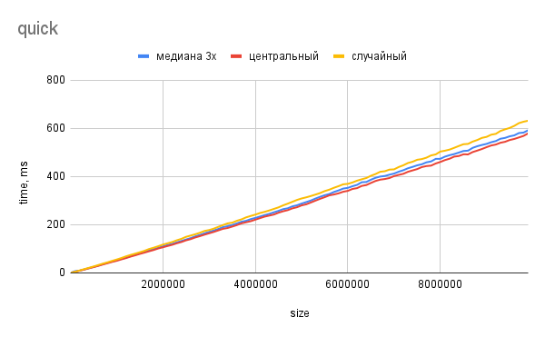
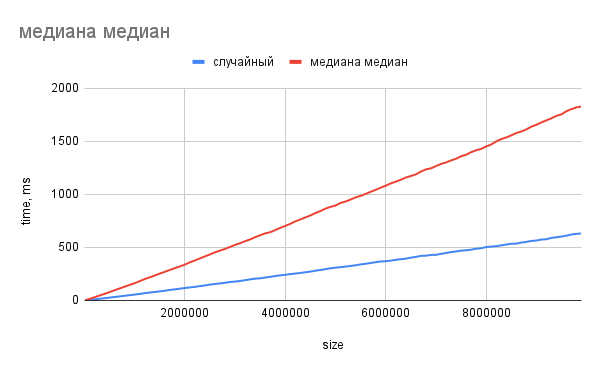

# Cравнение сортировок

>## Пункт 1. Cортировка вставками, пузырьком, выбором (2 б).
>Напишите сортировки вставками, пузырьком, выбором.
>
>Запускаем тест для массивов размера от 1000 до 1000000 с шагом 10000.
>Для каждого размера гененрируем массив, и сортируем, засечь время работы сортировки.
>*Все три сортировки тестим на одинаковых массивах*
>Для кажого размера и каждой сортировки делаем 5 тестов и усредняем итог.
>Построить график для каждой сортировки(из 100 точек). 

Результаты:

Приведенные выше сортировки имеют одинаковую асимптотику $O(n^2)$, но разные константы, которые зависят от того, насколько часто нужно менять элементы массива местами. Сортировка пузырьком в этом плане хуже всех, так как в ее реализации могут меняться местами только соседние элементы, что влечет много ненужных свапов. Причем, в отличие от сортировки вставками, элемент не всегда свапается в сторону своей конечной позиции в отсортированном массиве.

>## Пункт 2. Быстрая сортировка  (3 б. + 2 бонус).
>Делаем то же самое(такие же тесты, только теперь размеры до 10 млн, но >шаг 100000.), используем разные стратегии выбора опорного эелемента:
>*Сортировка и первые три пункта - это 3 б.*
>* медиана 3х 
>* центральный 
>* случайный
>* медиана медиан (+2б)

Результаты:

Исходя из графика, видно, что быстрые сортировки с использованием "простых" стратегий выбора опорного элемента почти не отличаются в производительности на случайных массивах. Небольшие расхождения во времени обысловлены скоростью выбора опорного элемента. Поиск центрального элемента быстрее вызова функции `rand()`, а та, в свою очередь, быстрее пересчета медианы трех.

Теперь рассмотрим более сложную стратегию выбора опорного элемента с помощью поиска медианы медиан групп из пяти элементов массива.

Как видно, данная стратегия работает медленнее. Преимущество данной стратегии заключается в том, что ее асимптотика $O(nlog(n))$ в любом случае, в то время, как для "простых" стратегий существуют контрпримеры, на которых они работают за $O(n^2)$. Но на случайных массивах это преимущество не отражается, зато огромная константа дает о себе знать.

>## Пункт 3. Сортировка слиянием (2 б).
>Добавить сортировку слиянием(такие же тесты, только теперь размеры до 10 млн, но шаг 100000).

Результаты:

_sorting.png)

Сортировка слиением медленнее быстрой из-за операции merge: в ней мы должны использовать дополнительный массив для операции слияния, после чего перекопировать его содержимое в исходный массив.
