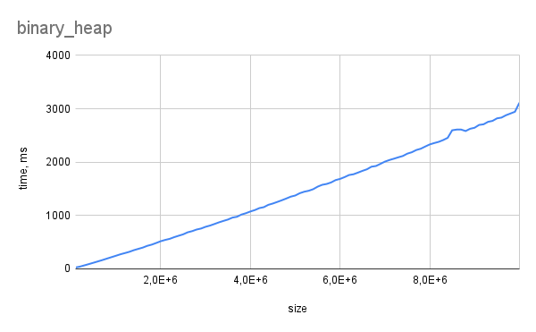
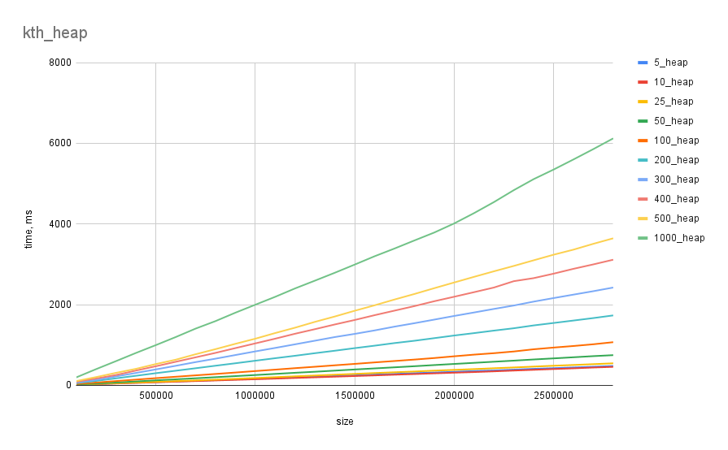
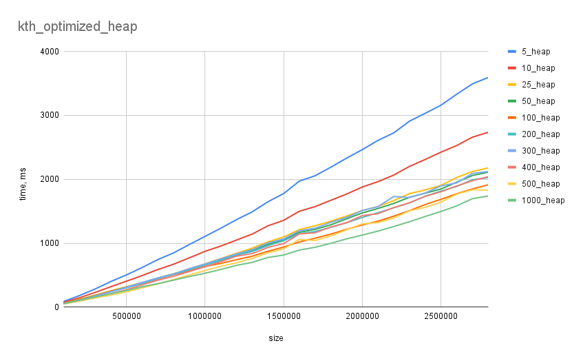

# Кучи

>## Пункт 1. Бинарная куча (2б)
>* Тесты генерируются как и в предыдущей лабе, размер массива от 100000 до 10000000, шаг 100000, для каждого размера 5 измерений.
>* Cделать heapsort для обычной бинарной кучи.
>* Засечь времена работы. Построить графики.

Результаты:

>## Пункт 2. k-ичная куча (5б)
>### 1)
>* Тесты генерируются как и в предыдущей лабе, размер массива от 100000 до 10000000, шаг 100000, для каждого размера 5 измерений.
>* Написать k-ичную кучу. Cделать HeapSort с помощью k-ичной кучи
>* Протестить для k = 5,10,25, 50, 100, 200, 300, 400, 500, 1000
>* Засечь времена работы. Построить графики.

Результаты:

Высота кучи: $h = O(log_{k}{n})$.
Extract_min работает за $O(hk)=O(klog_{k}{n})$, так как поиск минимального ребенка работает за линию. Так как функция $klog_{k}{n}(k)$ возрастает, то при росте `k` время увеличивается.

>### 2) 
>* Добавить поиск min/max ребенка с помощью бинарной кучи. Чтобы SiftDown заботал за O(log(k) log_k(N))
>* Протестить для k = 5,10,25, 50, 100, 200, 300, 400, 500, 1000
>* Засечь времена работы. Построить графики.

Результаты:

Оптимизация кучи заключается в том, что мы поддерживаем бинарную кучу для детей каждой вершины. Теперь поиск минимального ребенка осуществляется за $O(log_{2}{k})$, extract_min - за $O(log_{2}{k}log_{k}{n})=O(log_{2}{n})$, что равно асимптотике бинарной кучи и не зависит от k. Расхождения во времени обусловлены затратами на поддержание бинарных куч: для операций sift_up и sift_down необходимо удаление ключа из одной бинарной кучи и добавление в другую. Так как при росте `k` высота уменьшается, то количество переводов тоже уменьшается, и времени на зарос тратится меньше.

Так как асимптотика бинарной кучи равна асимптотике `k`-ичной оптимизированной куче, но расходов на поддержание дополнительных куч нет, то бинарная куча должна быть быстрее `k`-ичной оптимизированной при любом `k`.
